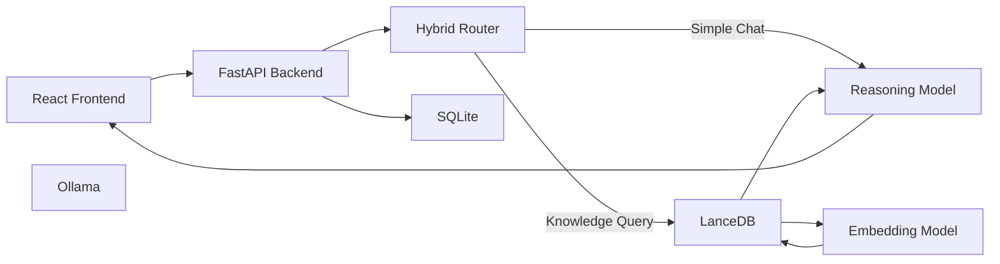

---

# 📸 Application Preview

<p align="center">
  
</p>

<p align="center">
<b>Enterprise RAG Platform Chat Interface</b><br>
Modern React-based UI with real-time streaming responses powered by a local Retrieval-Augmented Generation (RAG) pipeline.
</p>

---
# 🚀 Enterprise RAG Platform
### Enterprise-Style Local AI Knowledge Platform for Private Document Intelligence

<p align="center">


</p>

---

# 📖 Executive Summary

Enterprise RAG Platform is a **fully local Retrieval-Augmented Generation (RAG)** system designed to allow organizations and developers to securely interact with proprietary knowledge using modern Large Language Models without relying on cloud-based AI services.

Unlike traditional AI chatbots that transmit sensitive information to third-party APIs, this platform performs the **entire AI pipeline locally**, ensuring confidential documents remain inside the organization's infrastructure.

The system combines semantic search, vector databases, intelligent document parsing, streaming AI responses, persistent chat history, and automated document synchronization into a single enterprise-style application.

The platform is capable of indexing and understanding:

- Source Code
- Technical Documentation
- PDF Manuals
- HR Documents
- Financial Reports
- Internal Knowledge Bases
- Research Papers
- Text Documents

All inference, embedding generation, vector search, and response generation occur locally using **Ollama**, **LlamaIndex**, and **LanceDB**.

---

# 🎯 Project Goals

The objective of this project is to demonstrate how a modern enterprise AI assistant can be built entirely with open-source technologies while maintaining:

- Complete data privacy
- Local AI inference
- Real-time document synchronization
- Code-aware retrieval
- Streaming conversational responses
- Persistent chat history
- Efficient GPU utilization
- Modular backend architecture

---

# ✨ Key Features

## 🔒 100% Local AI

No OpenAI APIs.

No Anthropic APIs.

No Gemini APIs.

No internet-based inference.

Every stage of the pipeline runs locally using Ollama.

---

## 📄 Intelligent Document Ingestion

The ingestion engine automatically detects document types and processes them using specialized parsing strategies.

Supported content includes:

- PDF
- TXT
- Markdown
- Python Source Code

Future support can easily be extended for:

- DOCX
- HTML
- CSV
- JSON
- XML

---

## 🧠 Semantic Search

Instead of keyword matching, documents are converted into mathematical vector embeddings.

User questions are transformed into embeddings and compared against stored document vectors using similarity search.

This allows the AI to retrieve relevant knowledge even when exact words are not used.

---

## 💻 Code-Aware Understanding

Python source files are parsed using Tree-sitter through LlamaIndex's CodeSplitter.

Instead of breaking code randomly, the parser understands:

- Functions
- Classes
- Methods
- Imports

This preserves logical context and significantly improves code-related question answering.

---

## ⚡ Real-Time Document Synchronization

A background Watchdog process continuously monitors the private document directory.

Whenever a new file is added:

1. File detected
2. Parsed automatically
3. Chunked intelligently
4. Embedded
5. Stored inside LanceDB

No manual rebuilding of the vector database is required.

---

## 💬 Streaming AI Responses

The application uses **Server-Sent Events (SSE)**.

Instead of waiting for the complete answer, tokens stream to the browser as they are generated.

This provides an experience similar to ChatGPT.

---

## 🗄 Persistent Chat Memory

Conversation history is stored inside SQLite using SQLAlchemy.

Features include:

- Session tracking
- Conversation persistence
- Previous context retrieval

---

## ⚙ Hybrid Query Routing

Not every prompt requires document retrieval.

The backend intelligently classifies incoming prompts.

Simple greetings:

```
Hi
Hello
Good Morning
```

are sent directly to the LLM.

Knowledge-intensive questions automatically activate the Retrieval-Augmented Generation pipeline.

This reduces unnecessary vector searches while improving latency.

---

# 🏗 High-Level Architecture



---

# 🔄 End-to-End Workflow

```text
                 User Uploads Documents
                         │
                         ▼
                private_data Folder
                         │
                         ▼
                  Watchdog Monitor
                         │
                         ▼
              Intelligent Parser Selection
                         │
          ┌──────────────┴──────────────┐
          │                             │
          ▼                             ▼
 SentenceSplitter                 CodeSplitter
 (Text / PDF)                    (Python AST)
          │                             │
          └──────────────┬──────────────┘
                         ▼
                 Document Chunks
                         │
                         ▼
           nomic-embed-text Embeddings
                         │
                         ▼
                    LanceDB Storage
                         │
──────────────────────────────────────────────────────────
                         │
                    User Question
                         │
                         ▼
                  Hybrid Query Router
                         │
          ┌──────────────┴──────────────┐
          │                             │
          ▼                             ▼
     Simple Chat                  RAG Pipeline
          │                             │
          ▼                             ▼
       Ollama                  Similarity Search
                                       │
                                       ▼
                             Relevant Context
                                       │
                                       ▼
                               Qwen 3.5 Reasoning
                                       │
                                       ▼
                             Streaming Response
                                       │
                                       ▼
                                  React UI
```

---

# 🧩 System Components

| Layer | Technology | Purpose |
|--------|------------|----------|
| Frontend | React + Vite | Interactive user interface |
| Backend | FastAPI | REST API and streaming server |
| AI Framework | LlamaIndex | RAG orchestration |
| Vector Database | LanceDB | Semantic document retrieval |
| Embedding Model | nomic-embed-text | Vector embedding generation |
| Reasoning Model | Qwen 3.5 4B | Local language model |
| LLM Runtime | Ollama | Local inference engine |
| ORM | SQLAlchemy | Database abstraction |
| Database | SQLite | Persistent chat history |
| File Monitor | Watchdog | Automatic document synchronization |
| Streaming | Server-Sent Events | Real-time token streaming |

---

# 📁 Project Structure

```text
ENTERPRISE-RAG-PLATFORM/
│
├── enterprise-rag-ui/
│   │
│   ├── src/
│   ├── public/
│   ├── package.json
│   ├── vite.config.js
│   └── ...
│
├── src/
│   │
│   ├── ingestion.py
│   ├── monitor.py
│   ├── models.py
│   ├── query.py
│   ├── server.py
│   └── ...
│
├── private_data/
│
├── sample_data/
│
├── storage/
│   ├── LanceDB
│   └── SQLite
│
├── requirements.txt
│
├── .gitignore
│
└── README.md
```

---

# 📂 Directory Overview

## `enterprise-rag-ui`

Contains the complete React frontend responsible for:

- Chat interface
- Markdown rendering
- Code block rendering
- Streaming responses
- Dark theme
- API communication

---

## `src`

Contains the complete backend implementation.

Each module is designed with a single responsibility.

| File | Responsibility |
|------|----------------|
| ingestion.py | Reads documents and builds vector database |
| monitor.py | Watches for newly added files |
| server.py | FastAPI application and streaming endpoints |
| query.py | Local CLI testing |
| models.py | SQLite schemas |

---

## `private_data`

This directory contains proprietary documents.

Anything placed inside this folder becomes searchable by the AI after ingestion.

This folder is excluded from Git using `.gitignore`.

Never upload confidential company data to GitHub.

---

## `storage`

Stores generated artifacts including:

- LanceDB vector database
- SQLite conversation database

This directory is automatically created during the first ingestion process.


---

# 💻 Hardware Requirements

The Enterprise RAG Platform is designed to run on consumer-grade hardware while supporting local Large Language Models (LLMs). Although the project can operate on CPU-only systems, a dedicated NVIDIA GPU significantly improves embedding generation and inference speed.

## Minimum Requirements

| Component | Requirement |
|-----------|-------------|
| Operating System | Windows 10 / Windows 11 (64-bit) |
| Processor | Intel Core i5 (10th Gen or newer) / AMD Ryzen 5 |
| RAM | 16 GB |
| Storage | 15 GB Free SSD Space |
| Python | 3.11 or newer |
| Node.js | 20.x LTS |
| Git | Latest Version |
| GPU | Optional |

---

## Recommended Configuration

| Component | Recommendation |
|-----------|---------------|
| CPU | Intel Core i7 / Ryzen 7 |
| RAM | 32 GB |
| GPU | NVIDIA RTX 4050 / RTX 4060 / RTX 4070 |
| VRAM | 6 GB or higher |
| Storage | NVMe SSD |
| Python | 3.11+ |
| Node.js | Latest LTS |

---

## Tested Configuration

This project was primarily developed and tested using:

| Component | Specification |
|-----------|---------------|
| Operating System | Windows 11 |
| CPU | Intel Core i5-13420H |
| RAM | 24 GB |
| GPU | NVIDIA RTX 4050 Laptop GPU |
| VRAM | 6 GB |
| Python | 3.11 |
| Ollama | Latest Stable |
| Node.js | 20.x |

---

# 📦 Software Prerequisites

Before running the project, install the following software.

## 1. Python

Download the latest Python release.

https://www.python.org/downloads/

During installation, enable:

- ✅ Add Python to PATH

Verify installation:

```powershell
python --version
```

Expected output:

```text
Python 3.11.x
```

---

## 2. Git

Download Git:

https://git-scm.com/downloads

Verify installation:

```powershell
git --version
```

---

## 3. Node.js

Download the latest Long-Term Support (LTS) release.

https://nodejs.org

Verify installation:

```powershell
node --version

npm --version
```

---

## 4. Ollama

Download Ollama.

https://ollama.com/download

After installation verify:

```powershell
ollama --version
```

If the version is displayed, Ollama has been installed successfully.

---

# 🤖 Download Required AI Models

This project requires two local AI models.

## Embedding Model

Responsible for converting text into vector embeddings.

Download:

```powershell
ollama pull nomic-embed-text
```

---

## Reasoning Model

Responsible for answering questions using retrieved context.

Download:

```powershell
ollama pull qwen3.5:4b
```

Depending on your internet speed, downloading the models may take several minutes.

After downloading, verify available models:

```powershell
ollama list
```

Expected output:

```text
MODEL

qwen3.5:4b

nomic-embed-text
```

---

# 📥 Clone the Repository

Clone the project.

```powershell
git clone https://github.com/YOUR_USERNAME/Enterprise-RAG-Platform.git
```

Navigate into the project directory.

```powershell
cd Enterprise-RAG-Platform
```

---

# 🐍 Create a Python Virtual Environment

Creating a virtual environment isolates project dependencies from your global Python installation.

Create the environment.

```powershell
python -m venv .venv
```

Activate the environment.

### Windows PowerShell

```powershell
.\.venv\Scripts\Activate.ps1
```

### Windows Command Prompt

```cmd
.venv\Scripts\activate.bat
```

### Linux / macOS

```bash
source .venv/bin/activate
```

Once activated, your terminal should display:

```text
(.venv)
```

---

# 📦 Install Python Dependencies

Install all required backend libraries.

```powershell
pip install -r requirements.txt
```

This installs packages including:

- FastAPI
- Uvicorn
- LlamaIndex
- LanceDB
- SQLAlchemy
- Watchdog
- Ollama Python SDK
- Tree-sitter
- Markdown
- SSE libraries

Verify installation:

```powershell
pip list
```

---

# ⚛ Install Frontend Dependencies

Navigate to the React frontend.

```powershell
cd enterprise-rag-ui
```

Install all Node modules.

```powershell
npm install
```

After installation completes return to the project root.

```powershell
cd ..
```

---

# 📁 Prepare the Knowledge Base

Locate the folder:

```text
private_data/
```

Copy any supported documents into this directory.

Example:

```text
private_data/

│

├── Employee_Handbook.pdf

├── Company_Policies.pdf

├── backend.py

├── Financial_Report.pdf

├── README.md

└── architecture.txt
```

These files will become searchable after ingestion.

---

# 🧠 Build the Vector Database

The first time you run the project, embeddings must be generated.

Run:

```powershell
python src/ingestion.py
```

During this step the application will:

- Scan every document
- Detect file types
- Parse documents
- Split into chunks
- Generate embeddings
- Store vectors inside LanceDB

Depending on the number of documents, this process may take several minutes.

After completion the storage directory will be created automatically.

```text
storage/

├── LanceDB

└── SQLite
```

---

# 👀 Start Automatic File Monitoring (Optional)

To enable real-time synchronization of newly added documents, launch the Watchdog monitor in a separate terminal.

```powershell
python src/monitor.py
```

Leave this terminal running.

Whenever a new document is placed inside:

```text
private_data/
```

the monitor will automatically:

- Detect the file
- Parse the content
- Generate embeddings
- Update LanceDB

No manual ingestion is required.

---

# 🚀 Start the Backend Server

Open a new terminal.

Activate the virtual environment.

```powershell
.\.venv\Scripts\Activate.ps1
```

Launch the FastAPI application.

```powershell
uvicorn src.server:app --host 0.0.0.0 --port 8000 --reload
```

You should see output similar to:

```text
INFO: Uvicorn running on http://127.0.0.1:8000
```

Do not close this terminal while using the application.

---

# ⚛ Start the React Frontend

Open another terminal.

Navigate into the frontend.

```powershell
cd enterprise-rag-ui
```

Start the development server.

```powershell
npm run dev
```

Expected output:

```text
Local:

http://localhost:5173
```

Open the displayed URL in your web browser.

The Enterprise RAG Platform interface should now load.

---

# ✅ First-Time Verification Checklist

Before asking questions, confirm the following:

| Check | Status |
|--------|--------|
| Ollama installed | ✅ |
| Models downloaded | ✅ |
| Python dependencies installed | ✅ |
| React dependencies installed | ✅ |
| Documents placed in private_data | ✅ |
| ingestion.py executed | ✅ |
| Backend running | ✅ |
| Frontend running | ✅ |

If every item above is complete, your local RAG platform is ready to use.

---

# ▶ Running the Complete Application

The application consists of three independent processes.

### Terminal 1 (Optional)

```powershell
python src/monitor.py
```

Automatically synchronizes new documents.

---

### Terminal 2

```powershell
uvicorn src.server:app --reload
```

Runs the FastAPI backend.

---

### Terminal 3

```powershell
cd enterprise-rag-ui

npm run dev
```

Runs the React frontend.

---

Once all three services are running, open:

```text
http://localhost:5173
```

You can now upload documents to the `private_data` folder and interact with them through the chat interface.


---

# 🧠 How the RAG Pipeline Works

Retrieval-Augmented Generation (RAG) combines information retrieval with Large Language Models to answer questions using external knowledge rather than relying solely on the model's training data.

Unlike a standalone LLM, which answers from its internal knowledge, a RAG system first retrieves relevant information from a private knowledge base and then uses that information to generate a response.

The workflow implemented in this project is shown below.

```text
                     User Question
                           │
                           ▼
                 FastAPI Receives Request
                           │
                           ▼
                  Hybrid Query Router
                           │
          ┌────────────────┴────────────────┐
          │                                 │
          ▼                                 ▼
    Simple Conversation              Knowledge Query
          │                                 │
          ▼                                 ▼
     Ollama LLM                  Generate Embedding
                                            │
                                            ▼
                                 Search LanceDB
                                            │
                                            ▼
                                  Most Relevant Chunks
                                            │
                                            ▼
                             Build Prompt with Context
                                            │
                                            ▼
                                   Ollama (Qwen 3.5)
                                            │
                                            ▼
                                Streaming Response (SSE)
                                            │
                                            ▼
                                      React Frontend
```

The goal is to provide responses grounded in the uploaded documents instead of allowing the language model to rely entirely on its pre-trained knowledge.

---

# 📄 Document Ingestion Pipeline

Before users can ask questions, documents must be transformed into a format suitable for semantic search.

The ingestion pipeline performs the following operations.

```text
Document
   │
   ▼
Document Reader
   │
   ▼
File Type Detection
   │
   ▼
Chunk Selection
   │
   ▼
Embedding Generation
   │
   ▼
Vector Database
```

Each stage has a specific responsibility.

---

## Step 1 — Document Discovery

The ingestion process scans the configured document directory.

```text
private_data/
```

Every supported file discovered inside this directory becomes a candidate for indexing.

Supported formats currently include:

- PDF
- TXT
- Markdown
- Python Source Code

The architecture is modular, making it straightforward to extend support for additional formats in future releases.

---

## Step 2 — Intelligent File Detection

Different document types require different parsing strategies.

Instead of processing every file identically, the platform identifies the file type and selects the appropriate parser automatically.

```text
PDF
        │
        ▼
Sentence Splitter

Python
        │
        ▼
Code Splitter
```

This improves retrieval quality by preserving the natural structure of each document.

---

# ✂ Intelligent Chunking Strategy

Chunking is one of the most important stages of any Retrieval-Augmented Generation system.

Large Language Models cannot efficiently process entire books, repositories, or lengthy documents in a single request.

Instead, documents are divided into smaller sections called **chunks**.

Choosing where to split a document directly impacts retrieval quality.

This project implements two specialized chunking strategies.

---

## Semantic Chunking

Used for:

- PDF documents
- Plain text
- Markdown

Powered by:

```
SentenceSplitter
```

Instead of splitting every fixed number of characters, the splitter attempts to preserve logical meaning by grouping related sentences together.

Example:

Bad chunking:

```text
Page 5...

Azure Virtual Machines allow...

(random cutoff)

...available regions include...
```

Semantic chunking:

```text
Azure Virtual Machines allow developers to deploy scalable compute resources.

VMs support multiple operating systems including Windows and Linux.
```

Maintaining semantic coherence improves embedding quality and retrieval accuracy.

---

## AST-Based Code Chunking

Source code follows structural rules that differ significantly from natural language.

Randomly splitting code may separate function definitions, break classes, or lose contextual information.

For Python files, this project uses:

```
CodeSplitter
```

backed by Tree-sitter.

Tree-sitter parses the Abstract Syntax Tree (AST) of the source code, allowing chunks to align with meaningful programming constructs.

Example:

```python
class UserService:

    def login():

    def logout():

    def register():
```

Instead of splitting in the middle of the class, the parser preserves logical boundaries.

This results in significantly better code retrieval.

---

# 🧮 Embedding Generation

Once documents have been chunked, each chunk is converted into a numerical vector representation.

Embedding Model:

```
nomic-embed-text
```

Running through Ollama.

Each chunk becomes a high-dimensional mathematical vector representing semantic meaning rather than keywords.

Example:

```
"This function authenticates users."

↓

[0.281,
-0.118,
0.905,
...]
```

These vectors are stored inside LanceDB.

During question answering, user queries are converted into vectors using the same embedding model.

Similarity search is then performed between the query vector and stored document vectors.

---

# 🗄 Vector Database

The project uses LanceDB as its vector storage engine.

Responsibilities include:

- Vector indexing
- Similarity search
- Metadata storage
- High-speed retrieval

Rather than searching documents line by line, LanceDB compares vector distances to identify the most semantically relevant chunks.

This allows users to ask questions naturally instead of relying on exact keyword matches.

Example:

Document:

```
Employee leave policy
```

User asks:

```
How many vacation days do I receive?
```

Although neither sentence uses identical wording, the embedding vectors remain close in semantic space, allowing the correct document to be retrieved.

---

# 🔍 Query Processing Pipeline

Every user message follows the workflow below.

```text
User Message
      │
      ▼
FastAPI
      │
      ▼
Hybrid Router
      │
      ├─────────────── Greeting
      │                    │
      │                    ▼
      │              Ollama Direct
      │
      └────────────── Knowledge Query
                           │
                           ▼
                     Query Embedding
                           │
                           ▼
                    LanceDB Search
                           │
                           ▼
                 Relevant Document Chunks
                           │
                           ▼
              Prompt Construction
                           │
                           ▼
                     Ollama Qwen 3.5
                           │
                           ▼
               Streaming Response
```

---

# ⚙ Hybrid Query Router

Not every request requires document retrieval.

Simple conversational prompts are sent directly to the language model.

Examples include:

```
Hello

Hi

Good morning

Thank you

Who are you?
```

Knowledge-intensive prompts automatically activate the retrieval pipeline.

Examples include:

```
Explain the authentication module.

Summarize Employee Handbook.

Where is the database connection created?

Explain server.py.
```

This routing strategy reduces unnecessary embedding operations while improving responsiveness.

---

# 💬 Streaming Responses

Traditional APIs generate the complete response before sending anything back to the client.

This often results in noticeable waiting time.

The platform instead uses **Server-Sent Events (SSE)**.

Workflow:

```text
LLM

↓

Token 1

↓

Token 2

↓

Token 3

↓

Browser
```

Users begin seeing generated text almost immediately, creating a responsive conversational experience similar to modern AI assistants.

---

# 🗃 Conversation Persistence

Conversation history is stored using SQLite with SQLAlchemy.

Stored information includes:

- Session identifier
- User messages
- Assistant responses
- Conversation timestamps

Persistent history enables future enhancements such as:

- Multi-session conversations
- Searchable chat history
- Conversation restoration
- User-specific memory

---

# 🌐 Backend API

The backend exposes REST endpoints through FastAPI.

| Endpoint | Method | Description |
|-----------|--------|-------------|
| `/chat` | POST | Processes chat requests |
| `/stream` *(or your streaming endpoint)* | POST | Streams AI responses using SSE |
| `/health` *(recommended)* | GET | Returns server health status |

> **Note:** Update the endpoint names above to match your actual implementation if they differ.

---

# 📡 Frontend–Backend Communication

The React frontend communicates with the FastAPI backend using HTTP requests.

The interaction flow is:

```text
React UI
      │
      ▼
HTTP Request
      │
      ▼
FastAPI
      │
      ▼
Hybrid Router
      │
      ▼
LLM / LanceDB
      │
      ▼
Streaming Response
      │
      ▼
React UI
```

Streaming is handled using Server-Sent Events so that responses are rendered incrementally instead of waiting for the full completion.

   ---

# ⚡ Performance Considerations

Running Large Language Models locally can quickly exhaust system memory and GPU resources. This project incorporates several architectural decisions to improve responsiveness while remaining compatible with consumer hardware.

## Memory Optimization

The retrieval pipeline intentionally limits the number of retrieved chunks sent to the language model.

```python
similarity_top_k = 1
```

By retrieving only the most relevant document chunk, the application:

- Reduces prompt size
- Lowers GPU memory usage
- Improves response time
- Minimizes irrelevant context

This configuration was selected to ensure reliable execution on GPUs with limited VRAM.

---

## Local Model Loading

Large language models require time to initialize.

The backend is configured with extended timeout settings to prevent premature request failures while the local model is loading into memory.

---

## Streaming Responses

Instead of waiting for the entire response to finish generating, the backend streams tokens to the frontend using **Server-Sent Events (SSE)**.

Benefits include:

- Faster perceived response time
- Improved user experience
- Lower interface latency
- ChatGPT-style streaming output

---

## Automatic Document Synchronization

A background Watchdog process continuously monitors the document directory.

Whenever a supported file is added, modified, or removed, the system can automatically update the vector database without requiring manual re-indexing.

This enables a more seamless workflow when the knowledge base changes frequently.

---

# 🔒 Security & Privacy

One of the primary design goals of this project is to keep sensitive information under the user's control.

## Local Processing

The application performs:

- Document parsing
- Embedding generation
- Vector search
- LLM inference

entirely on the local machine.

No document content or prompts are transmitted to external AI providers.

---

## Sensitive Data Protection

The following directories should remain excluded from version control.

```text
private_data/
storage/
.venv/
__pycache__/
node_modules/
```

These directories may contain:

- Proprietary documents
- Generated vector databases
- Local chat history
- Python virtual environments
- Node dependencies

A properly configured `.gitignore` helps prevent accidental commits of generated or confidential files.

---

## Deployment Considerations

If deploying beyond local development, consider adding:

- User authentication
- Role-based access control (RBAC)
- HTTPS
- Reverse proxy (Nginx/Caddy)
- Docker containers
- Secrets management
- Rate limiting
- Logging and monitoring

---

# 🧪 Testing

After starting both the backend and frontend, verify the following functionality.

## Application Startup

- Backend launches successfully.
- Frontend loads in the browser.
- Ollama is running.
- Required models are available.

---

## Document Ingestion

Add a supported document to:

```text
private_data/
```

Run ingestion or wait for the Watchdog process.

Confirm that the document becomes searchable.

---

## Question Answering

Ask questions related to the uploaded document.

Example:

```text
Summarize the employee handbook.

Explain the authentication module.

What does server.py do?

Describe the project architecture.
```

The response should reference the uploaded content rather than relying solely on the model's prior knowledge.

---

## Streaming

Confirm that responses appear incrementally instead of waiting for the full answer.

---

# 🐞 Troubleshooting

## Ollama Not Found

Error:

```text
'ollama' is not recognized as an internal or external command
```

Solution:

- Verify Ollama is installed.
- Restart the terminal.
- Ensure Ollama is added to the system PATH.

---

## Missing Models

Error:

```text
Model not found
```

Solution:

```powershell
ollama pull qwen3.5:4b

ollama pull nomic-embed-text
```

---

## Empty Search Results

Possible causes:

- No documents in `private_data`
- Ingestion has not been executed
- Vector database is empty

Run:

```powershell
python src/ingestion.py
```

---

## Backend Connection Failed

Verify the FastAPI server is running.

Expected URL:

```text
http://localhost:8000
```

If not running:

```powershell
uvicorn src.server:app --reload
```

---

## Frontend Cannot Connect

Verify:

- Backend is running
- API URL matches the backend port
- Browser console shows no network errors

---

## CUDA Not Available

If running on CPU only, performance will be slower.

Verify GPU availability:

```python
import torch

print(torch.cuda.is_available())
```

---

## Python Package Errors

Update pip.

```powershell
python -m pip install --upgrade pip
```

Reinstall dependencies.

```powershell
pip install -r requirements.txt
```

---

# 📈 Future Improvements

Potential enhancements include:

- Multi-user authentication
- User accounts and profiles
- Role-Based Access Control (RBAC)
- Docker support
- Docker Compose deployment
- Kubernetes deployment
- GPU scheduling
- Multi-model routing
- Hybrid search (keyword + vector)
- Image and OCR document support
- DOCX support
- CSV and Excel ingestion
- Audio transcription
- Multi-language retrieval
- Conversation memory across sessions
- REST API documentation
- Unit and integration testing
- CI/CD pipeline
- Observability and monitoring
- Cloud deployment options

---

# 🤝 Contributing

Contributions are welcome.

If you would like to improve the project:

1. Fork the repository.
2. Create a feature branch.
3. Implement your changes.
4. Commit with clear messages.
5. Open a Pull Request describing your changes.

Please ensure new code follows the existing project structure and coding style.

---

# 📚 Learning Resources

The following technologies were used during development.

- Python
- FastAPI
- React
- Vite
- LlamaIndex
- Ollama
- LanceDB
- SQLAlchemy
- SQLite
- Tree-sitter
- Watchdog
- Server-Sent Events (SSE)

For detailed documentation, refer to each project's official website.

---

# 📄 License

This project is licensed under the MIT License.

You are free to use, modify, and distribute this software in accordance with the terms of the license.

If you plan to use this project in a commercial environment, review the licenses of all third-party dependencies to ensure compliance.

---

# 🙏 Acknowledgements

This project builds upon several excellent open-source technologies.

Special thanks to the maintainers and contributors of:

- FastAPI
- React
- Vite
- Ollama
- LlamaIndex
- LanceDB
- SQLAlchemy
- Tree-sitter
- Watchdog

Their work makes projects like this possible.

---

# ⭐ Project Status

**Current Status:** Active Development

This repository demonstrates a complete locally hosted Retrieval-Augmented Generation (RAG) workflow, including document ingestion, semantic retrieval, streaming responses, and a modern web interface.

The architecture is intentionally modular so that additional document formats, retrieval strategies, language models, and deployment options can be integrated with minimal changes.

---

# 👨‍💻 Author

**Sanam Bhanu Prakash**

GitHub: https://github.com/SanamBhanuPrakash

If you find this project useful, consider giving it a ⭐ on GitHub. Feedback, suggestions, and contributions are always appreciated.
